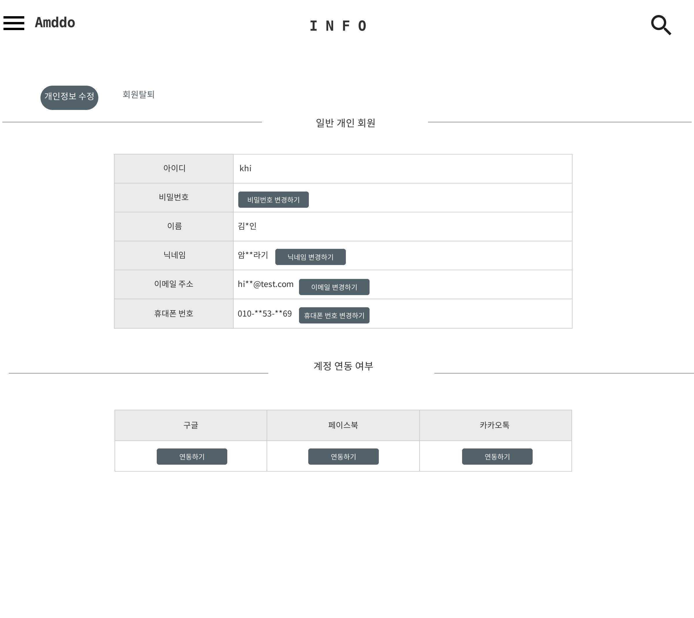

# UC005 - 계정연동여부 관리
회원이 계정연동여부를 조회하고 설정, 변경, 삭제하는 유스케이스

## 주 액터(Primarty Actor)
회원

## 보조 액터(Secondary Actor)
구글, 페이스북, 카카오

## 사전 조건(Preconditions)
- 로그인한 상태이다.

## 종료 조건(Postconditions)

## 시나리오(Flow of Events)

### 기본 흐름(Basic Flows of Events)
1. 액터가 회원정보 수정 메뉴에서 개인정보 수정 버튼을 클릭할 때 이 유스케이스를 시작한다.
2. 구글, 페이스북, 카카오 계정과 연동하려면 원하는 보조 액터의 연동하기 버튼을 누른다.

## UI 프로토타입

