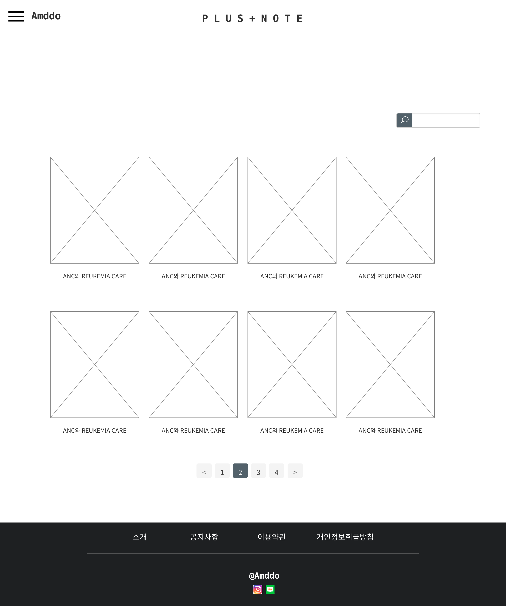
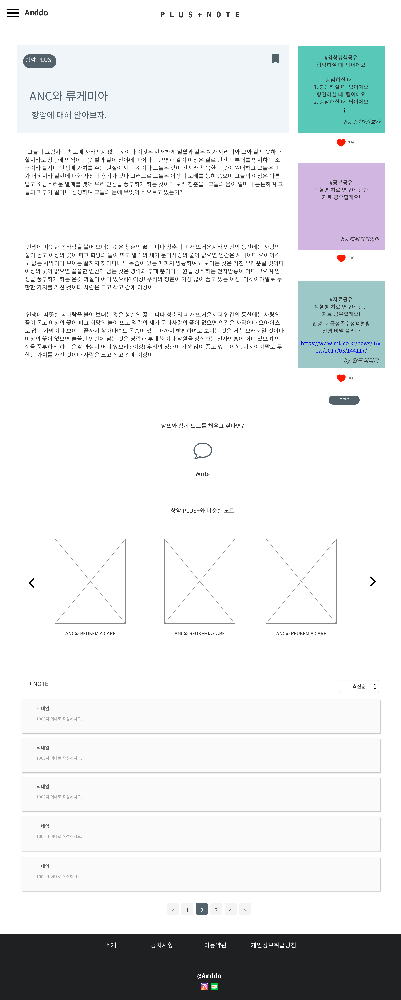

# UC009 - 플러스노트 조회

## 주 액터(Primarty Actor)
회원

## 보조 액터(Secondary Actor)

## 사전 조건(Preconditions)
- 로그인한 상태이다.

## 종료 조건(Postconditions)

## 시나리오(Flow of Events)

### 기본 흐름(Basic Flows of Events)
1. 액터는 플러스노트 메뉴를 클릭한다.
2. 시스템은 플러스노트 목록을 출력한다.
    - 기본값 : 최근 노트 등록 순 4 * 2개, 페이지당 8개의 노트 노출.
    - 액터가 검색어를 입력하면,
        '플러스노트 검색' 유스케이스로 간다.
3. 액터는 상세조회할 노트를 클릭한다.
4. 시스템은 플러스노트 상세 정보(글, 공감수 best 댓글 3개, 자동추천글, 댓글 목록)를 출력한다.
    - 액터가 북마크 버튼을 클릭하면,
        '플러스노트 북마크' 유스케이스로 간다.
    - 액터가 write 버튼을 클릭하면,
        '플러스노트 댓글 등록' 유스케이스로 간다.
    - 액터가 비슷한 노트를 조회하면,
        '관련노트 자동추천' 유스케이스로 간다.
    - 액터가 공감 버튼을 클릭하면,
        '플러스노트 댓글 공감' 유스케이스로 간다.

## UI 프로토타입

