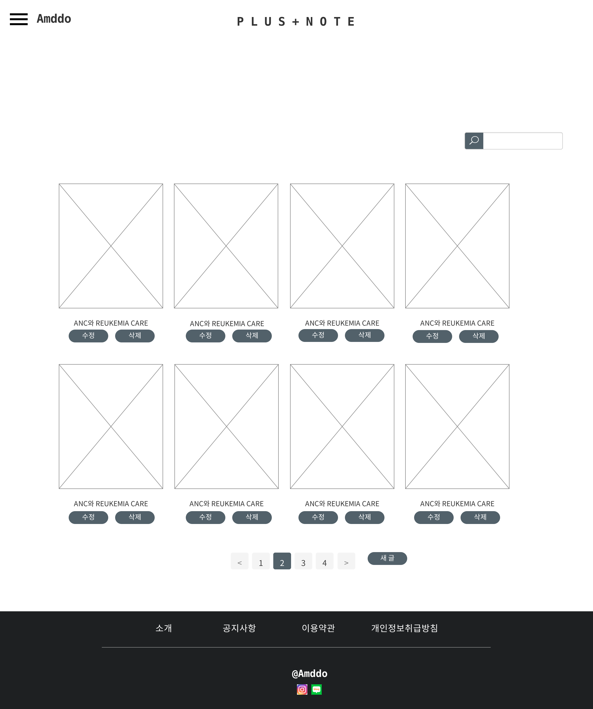

# UC012 - 플러스노트 댓글 삭제
## 주 액터(Primarty Actor)
관리자

## 보조 액터(Secondary Actor)

## 사전 조건(Preconditions)
- 관리자 계정으로 로그인한 상태이다.

## 종료 조건(Postconditions)

## 시나리오(Flow of Events)

### 기본 흐름(Basic Flows of Events)
1. 액터는 플러스노트 페이지에서 플러스노트 댓글 관리를 클릭한다.
2. 시스템은 플러스노트 댓글 목록을 출력한다.
3. 분류와 정책에 맞지 않는 댓글은 삭제 버튼을 누른다.
4. 시스템은 '정말 삭제하시겠습니까?' 경고 내용을 출력한다.
  - 확인 버튼을 누르면 시스템은 해당 글을 삭제한 후 '플러스노트 댓글 목록' 유스케이스로 이동한다.
  - 취소 버튼을 누르면 경고 창을 닫는다.

## UI 프로토타입

