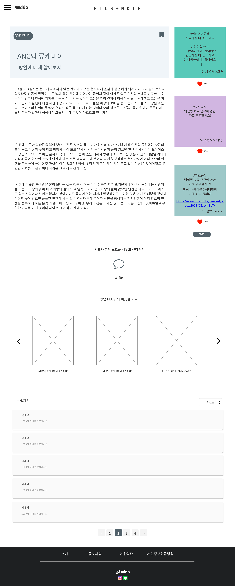

# UC014 - 관련노트 자동추천

회원이 선택한 플러스노트와 관련된 노트를 자동으로 추천하는 유스케이스

## 주 액터(Primarty Actor)
회원

## 보조 액터(Secondary Actor)

## 사전 조건(Preconditions)
- 로그인한 상태이다.

## 종료 조건(Postconditions)

## 시나리오(Flow of Events)

### 기본 흐름(Basic Flows of Events)
1. 시스템은 플러스노트의 분류 키워드를 포함하고 있는 다른 플러스노트 게시물을 검색하여 이를 출력한다.
  - 기본값 : 3개의 글 목록
2. 액터가 상세조회할 노트를 클릭한다.
  - 액터가 이전글, 다음글 버튼을 누르면, 시스템은 추가적으로 게시물을 검색하여 이를 출력한다. 
3. 액터가 게시물을 클릭하면, 시스템은 '플러스노트 조회' 유스케이스의 4번으로 간다.

## UI 프로토타입
