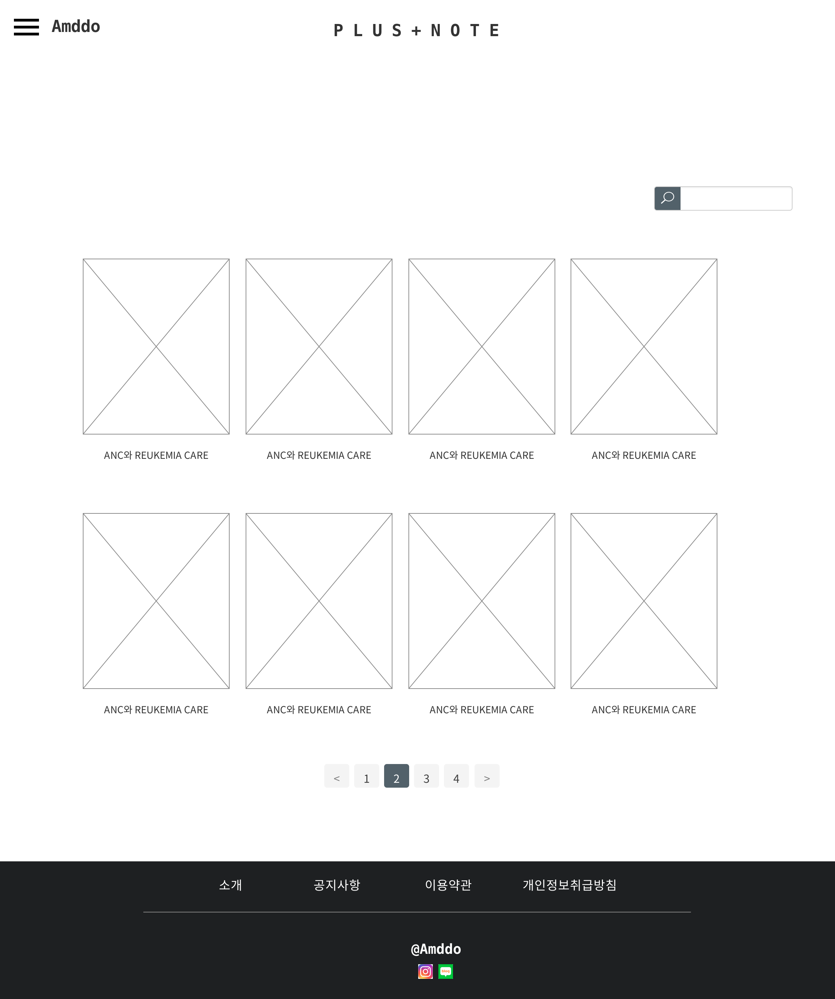

# UC015 - 플러스노트 검색

회원이 플러스노트 글을 검색하는 유스케이스

## 주 액터(Primarty Actor)
회원

## 보조 액터(Secondary Actor)

## 사전 조건(Preconditions)
- 로그인한 상태이다.

## 종료 조건(Postconditions)

## 시나리오(Flow of Events)

### 기본 흐름(Basic Flows of Events)
1. 액터는 입력 폼에 검색할 노트를 입력한다.
2. 시스템은 해당 키워드의 노트를 검색하여 결과를 출력한다. 

## UI 프로토타입
