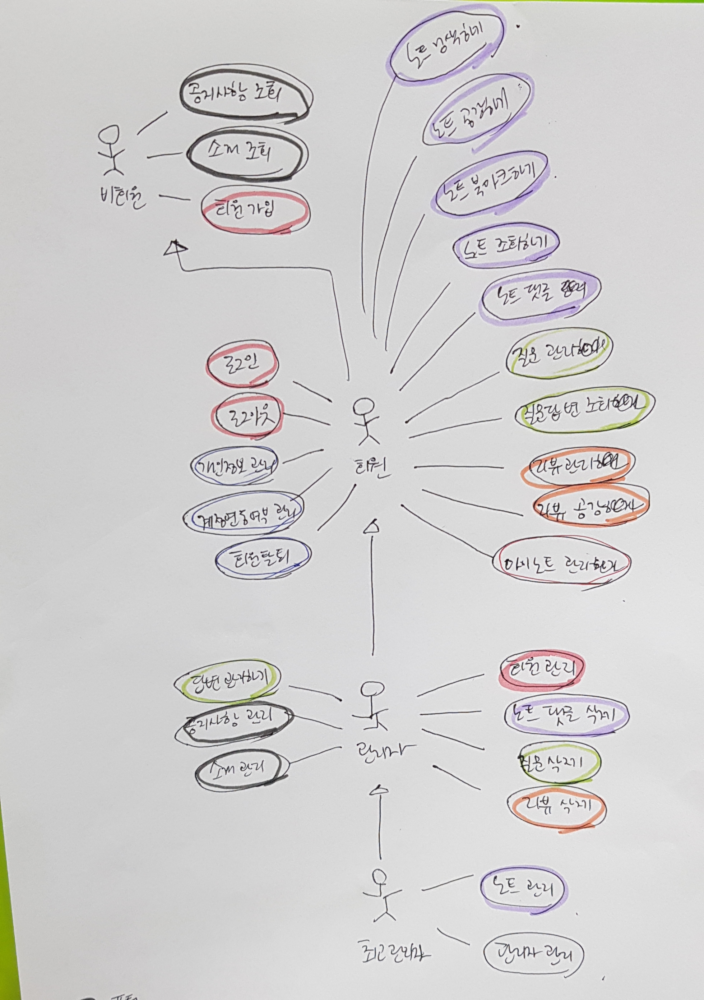

# 유스케이스

## Actors
회원, 비회원  

### 비회원
- 시스템에 로그인 하지 않은 사용자

### 회원
- 시스템에 로그인 한 사용자

### 간호학생
- 간호학생으로 등록된 로그인 사용자

### 간호사
- 간호사로 등록된 로그인 사용자

### 최고관리자
- 관리자에 등록된 로그인 사용자

### 관리자
- 관리자에 등록된 로그인 사용자

## Use-Cases

### [회원가입](uc001-SignUp.md)(비회원)
- 비회원이 로그인을 위해 회원에 가입하는 것.

### [로그인](uc002-LogIn.md)(회원)
- 회원이 로그인을 하는 것

### [로그아웃](uc003-Logout.md)(회원)
- 로그인된 회원이 로그아웃을 하는 것

### [개인정보 관리](uc004-Privacy.md)(회원)
- 회원이 자신의 정보를 조회, 변경하는 것

### [계정연동여부 관리](uc005)(회원)
- 회원이 자신의 정보를 연동할 것인지 설정, 조회, 변경, 삭제하는 것.

### [회원탈퇴](uc006-Leave.md)(회원)
- 회원이 서비스에서 탈퇴하는 것.

### [회원관리](uc007)(관리자)
- 회원을 조회, 변경, 삭제하는 것

### [플러스노트 관리](uc008-ManagePN.md)(최고관리자)
- 최고관리자가 플러스노트를 등록, 조회, 변경, 삭제하는 것

### [플러스노트 조회](uc009-NoteList.md)(회원)
- 회원이 플러스노트를 조회하는 것.

### [플러스노트 북마크](uc010-Bookmark.md)(회원)
- 회원이 플러스노트를 마이노트로 저장하는 것

### [플러스노트 댓글 관리](uc011-ManageComment.md)(회원)
- 회원이 플러스노트 댓글을 등록, 조회, 변경, 삭제하는 것

### [플러스노트 댓글 공감](uc012-LikeComment.md)(회원)
- 회원이 플러스노트 댓글을 공감하는 것

### [플러스노트 댓글 삭제](uc013-DeleteComment.md)(관리자)
- 관리자가 플러스노트 댓글을 삭제하는 것

### [플러스노트 자동 추천](uc014-AutoRecommend.md)(회원)
- 회원이 플러스노트 자동추천글을 조회하는 것

### [플러스노트 검색](uc015-SearchNote.md)(회원)
- 회원이 플러스노트를 검색하는 것

### [질문 관리](uc016-ManageQuetion.md)(회원)
- 회원이 자신이 질문한 것을 등록, 조회, 변경, 삭제하는 것.

### [질문 삭제](uc017-DeleteQuetion.md)(관리자)
- 관리자가 질문을 삭제하는 것

### [답변 관리](uc018-ManageAnswer.md)(관리자)
- 관리자가 회원이 질문한 것을 답변, 변경, 삭제하는 것.

### [질문답변조회](uc019-QnAList.md)(회원)
- 회원이 질문 답변을 조회하는 것

### [리뷰 관리](uc020-ManageReview.md)(회원)
- 회원이 리뷰 내용을 등록, 조회, 변경, 삭제하는 것.

### [리뷰 삭제](uc021-DeleteReview.md)(관리자)
- 관리자가 리뷰를 삭제하는 것

### [리뷰 공감](uc022-LikeReview.md)(회원)
- 회원이 리뷰 내용을 공감하는 것.

### [마이노트 관리](uc023-ManageMN.md)(회원)
- 회원이 마이노트를 조회, 삭제하는 것

### [공지사항 관리](uc024-ManageNotice.md)(관리자)
- 관리자가 공지사항을 등록, 조회, 수정, 삭제하는 것.

### [공지사항 조회](uc025-NoticeList.md)(비회원, 회원)
- 공지사항을 조회하는 것

### [소개 관리](uc026-ManageIntro.md)(관리자)
- 웹 사이트 소개 내용을 등록, 조회, 수정, 삭제하는 것.

### [소개 조회](uc027-Intro.md)(비회원, 회원)
- 웹 사이트 소개 내용을 조회하는 것

### [관리자 관리](uc028)(최고관리자)
- 최고관리자가 관리자들을 등록, 조회, 수정, 삭제하는 것.
